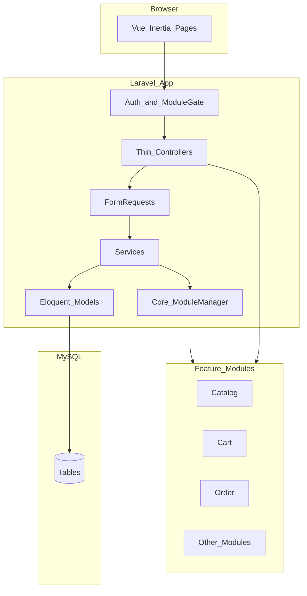
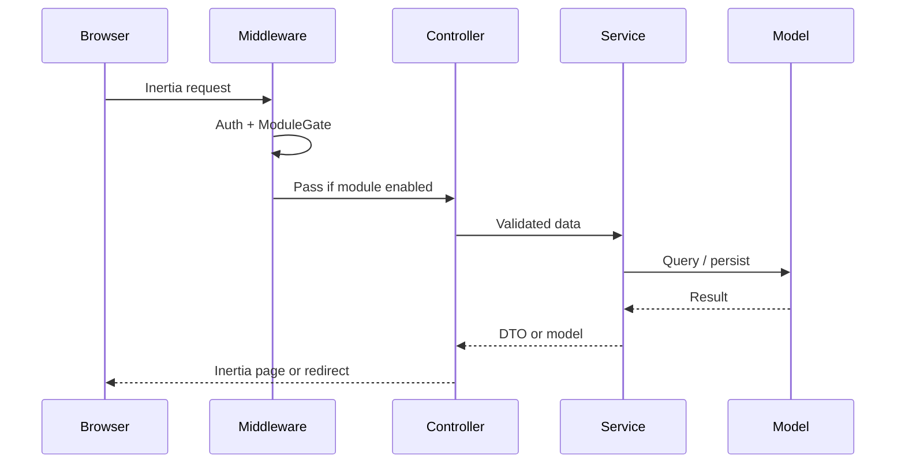

# System Overview

High-level map of the **NexCore** platform (Commerce Operating System: retail + wholesale + ecommerce + ERP modules).

Business positioning, domain ownership, and phased delivery: [business-vision.md](business-vision.md).

## Architecture at a glance

## Layers

| Layer | Responsibility |
|-------|----------------|
| Vue + Inertia | UI, forms, partial reloads |
| Middleware | Auth, CSRF, `EnsureModuleEnabled` |
| Controller | HTTP only: call service, return Inertia/redirect |
| FormRequest | Validation |
| Service | Business rules, transactions, events |
| Eloquent Model | Persistence, relations, scopes |
| Core | Module registry, subscription gate, shared base classes |

## Core vs modules

- **`app/Core/`** — always loaded: module manager, middleware, shared support
- **`app/Models/`** — true core models only (e.g. `User`, tenant if any)
- **`modules/{Name}/`** — feature modules (Catalog, Cart, Order, …)

Disabled or unsubscribed modules do not register routes, menus, or Inertia pages.

## Request flow

## Cross-module communication

Modules must not import each other’s Models or Controllers.

Allowed:

1. **Contract** in Core, implemented by a module, resolved via container
2. **Domain events** dispatched by one module, listened by another

## Performance stance

- Eager-load deliberately; avoid N+1
- Paginate lists
- Cache module registry (and config); Redis only when needed later
- Queues for email and heavy work only
- Prefer Laravel built-ins over extra packages
